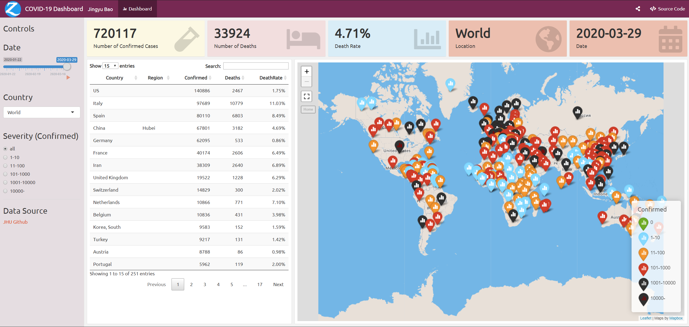

# Covid-19-Dashboard

## Dashboard

The dashboard is saved in [my app](https://app.zhongjzsb.com/COVID-19-dashboard/).

## References

- data source:
  - [open-covid-19](https://github.com/open-covid-19/data)
  - [JHU CSSE](https://github.com/CSSEGISandData/COVID-19)
- Matt Dary's [crosstalk](https://matt-dray.github.io/earl18-crosstalk/)
- [leaflet-tutorial](https://github.com/SimonGoring/ShinyLeaflet-tutorial/blob/master/Shiny-leaflet-tutorial.Rmd)
- [shiny tutorial](https://rstudio.github.io/leaflet/shiny.html)
- [flexdashboard-issue-236](https://github.com/rstudio/flexdashboard/issues/236)
